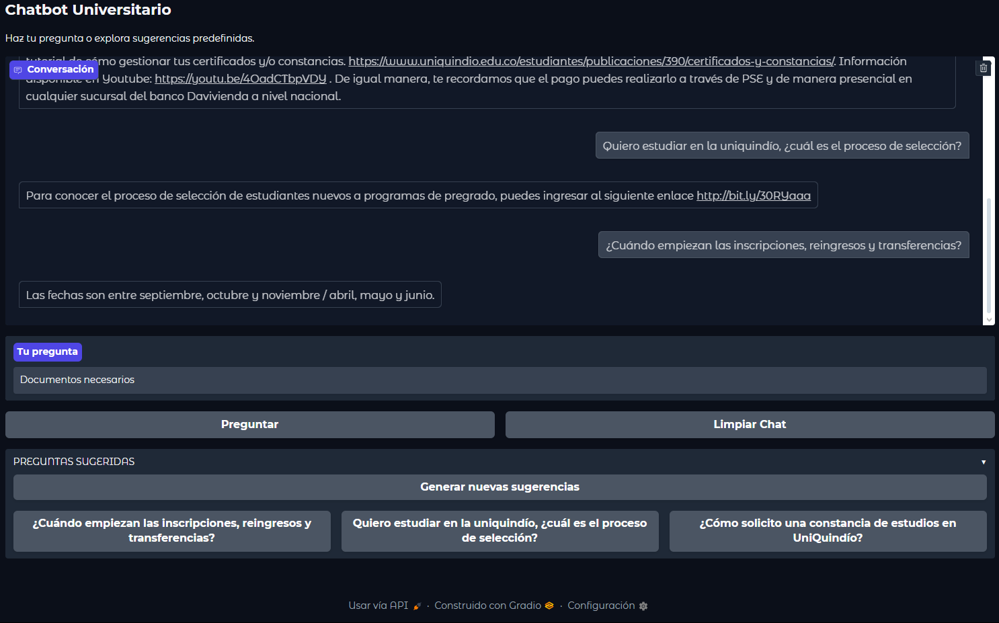

# Chatbot Universitario

---

## Resumen

Chatbot Universitario es un proyecto en Python que permite a los estudiantes obtener **respuestas automáticas a preguntas frecuentes** mediante procesamiento de lenguaje natural (NLP).  
El bot utiliza **TF-IDF** y **spaCy** para identificar la pregunta más similar en su banco de datos y responde de manera precisa. Además, ofrece **sugerencias dinámicas** y detecta preguntas desconocidas para guiar al usuario.

---

## Características

- Respuestas automáticas según similitud de texto.
- Sugerencias dinámicas de preguntas.
- Preprocesamiento de texto con limpieza, stopwords y lematización.
- Detección de preguntas desconocidas con umbral de similitud.
- Interfaz interactiva con Gradio.
- Diferenciación entre versión experimental (NLTK, stemmer) y profesional (spaCy, TF-IDF).

---

## Instalación y ejecución

### 1. Clonar el repositorio
  git clone https://github.com/Juanjo0812/Chatbot_Universitario.git\
  cd Chatbot_Universitario

### 2. Crear y activar entorno virtual
  python -m venv venv
  venv\Scripts\activate  # Windows
  source venv/bin/activate  # Linux/macOS

### 3. Instalar dependencias
  pip install -r requirements.txt
  python -m spacy download es_core_news_sm

### 4. Ejecutar la aplicación
  python src/app.py

## Estructura del proyecto
.
├── data/
│   └── Data_bot.csv          # Banco de preguntas y respuestas
├── notebooks/
│   └── experimentacion.ipynb # Versión de prueba con NLTK
├── src/
│   ├── utils.py              # Preprocesamiento y vectorización
│   ├── chatbot.py            # Lógica principal del bot
│   └── app.py                # Interfaz Gradio
├── requirements.txt          # Dependencias
└── README.md                 # Documentación

## Notas importantes

- La versión profesional está en src/.
- notebooks/experimentacion.ipynb muestra la fase inicial con NLTK.
- El chatbot tiene un umbral de similitud para detectar preguntas desconocidas.
- Las sugerencias se generan aleatoriamente cada vez que se presiona el botón.

## Ejemplos de uso

1. Pregunta directa
  Usuario: "¿Cuál es el horario de la biblioteca?"
  Bot: "La biblioteca está abierta de lunes a viernes de 7:00 a 19:00."

2. Uso de sugerencia
  Usuario hace click en "Requisitos para inscribirse en la universidad".
  Bot devuelve la respuesta correspondiente automáticamente.

3. Pregunta desconocida
  Usuario: "¿Cuándo empieza la temporada de fútbol?"
  Bot: "No entendí tu pregunta, ¿puedes reformularla?"

## Captura de pantalla principal

